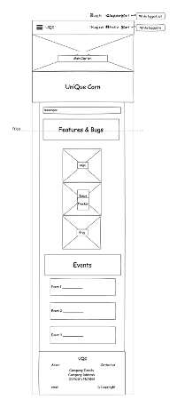
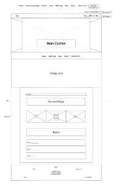
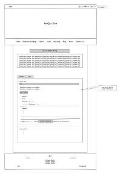
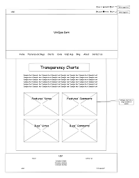

# **UniQueCorn Issue Tracker**
[](https://travis-ci.org/abonello/project_5)

----
## Project 5

*Milestone project for **Full-stack frameworks***  

This submission is part of the Fullstack Software Development diploma course offered by Code Institute.

*Developer: Anthony Bonello*

-------
**INDEX**

* [INTRODUCTION](#introduction)
* [UXD](#uxd)  
    * [Strategy](#strategy)
    * [Scope](#scope)
    * [Structure](#structure)
    * [Skeleton](#skeleton)
    * [Surface](#surface)
* [WIREFRAMES](#wireframes)
* [TECHNOLOGIES USED](#technologies-used)
* [TESTING](#testing)
* [DEPLOYMENT](#deploy-to-heroku)
* [FURTHER NOTES](#further-notes)
* [DATABASE](#database)
---
  
## INTRODUCTION
* [Back to TOP](#uniquecorn-issue-tracker)

This app allows users to log in bugs as well as asks for new features for a fictitious app, **UniQue Corn**, that supposedly produces corn to feed people. This app is mired in bugs and lack of proper functionality, so there will be lots of bugs to report. Users can also vote for features and bugs they would like to see fixed. The more votes a feature or bug has, the larger the likelihood they will be worked on.

Artistically, this app is a parody on the current political events in the UK around the brexit issue.

---

## UXD
* [Back to TOP](#uniquecorn-issue-tracker)

This app tracks bugs and new features for a fictitious app called UniQue Corn. Data is stored in a **PostgreSQL** database. Users can buy coins which will be spent to request a new feature or vote up features and bugs.


### **Strategy** 
* [Back to TOP](#uniquecorn-issue-tracker)

**What do I want as the owner of this web app?**
I want users to be able to ask for new features and report bugs they find while using UniQue Corn App. Users can review features and bugs posted by others and leave comments about them. They can also vote for features and bugs to make them happen earlier. Users can vote for a particular feature or bug as many times as they wish if they particularly would like to support a particular one. They can even vote for their own submissions. After all, the more money we can do from this, the better.


#### What does it do?
Track issues, features and bugs reaised by the users for the developers to deal with. The developers get an idea of urgency and backing from users from the amount of votes and comments. It is also a source of funding for developing the project.


#### How does it work
Users can read about the UniQueCorn App. If they register, they can request new functionality through the appropriate form. Users can also report bugs as well as comment and vote for features and bugs that are already on the system.

---

### **Scope** 
* [Back to TOP](#uniquecorn-issue-tracker)

#### Features to implement

The app should allow the user to fullfill the following tasks:

* Users can navigate through the site using a navigation system which is functional using typical menu system for both mobile and desktop platforms.  
* The site is fully responsive.  
   _

* Users can register.  
* Users can log in.    
* Users can log out.  
* Users can see their own profile.  
* Users can reset the password (if they forget it).  
* Users can see forthcoming events on the home page.
* Home page has quick links to important pages.  
* Users can read about UniQue Corn App.  
* Users can read the blog.  
* Users can read more information about us.  
* Users can contact us using a form.  
  _

**The following pages/features require login.**  
* Users can buy coins. This feature has cart functionality and checkout that will accept payment using a card, powered by Stripe.  
* Users can read / add features (paid for by coins) and bugs (free).  
* Users can up-vote features and bugs (paid for by coins) increasing their likelihood to be worked on by the development team.  
* Users can add comments to both bugs and features (free for both).  
* Users can see information about how many comments and votes each feature and bug has in the form of dynamic charts. These read the information directly from the database upon rendering of the page.

#### User stories

**User wants to register with the site**  
1. Click on the `Register` menu item.  
    (If the user had already registered previously, they will be allowed to go to the sign in page.)
2. Fill in the form.
3. Click the `Register` button.

**User wants to see their own profile** 
1. User clicks on the `Login` menu item (if not already logged in).
2. User clicks on the `Profile` menu item.

This is useful if a user wants to check how many coins he/she owns.

**User needs to reset the password (ex if they forget it)**
1. (When logged out) The user clicks on the `Login` menu item.
2. The user clicks on the `Reset Password` link.
3. The user fills in the email and clicks on the `Reset Password` button.
4. If the email is used to register a user, an email will be sent. The same message will be displayed to the user independently of whether the email exist or not.
5. If the email was found in the database the user will receive an email containing a link to reset the password.
6. The user opens the email and clicks on the link inside. This will take the user to the `Reset Password` page.
7. The user is taken to a page confirming the change in password and contains a link to the `login page`.

**User wants to find info about forthcoming events**
These are found on the home page.

**User wants to read about UniQue Corn App**
This is found the `UQC App` page. This can be reached by selecting the `UQC App` menu item or from the `UQC App Quick link` in the home page.

**User wants to download the UniQue Corn App**
Sorry but due to the multitude of bugs in this app and the high risk to human life the download of this app has been restricted for the forseable future.

**User wants to read the blog**
This is found the `Blog` page. This can be reached by selecting the `Blog` menu item or from the `Blog Quick link` in the home page.

**User wants to read more information about us**
This is found the `About` page. This can be reached by selecting the `About` menu item.

**User wants to contact us using**
A specific form for this purpose can be found by following the `Contact Us` menu item. 
1. The user fills in all the fields of this form.
2. The user clicks the `Submit` button.

**The following user stories require login.** 

**User wants to buy coins**
1. After logging in the user goes to the `Coins` page (use the `Coins` menu item)
2. The default number of packages to buy is one. The user can change this.
3. The user clicks on the `Add` button.
4. The number of packages selected by the user will be placed in the cart. The `cart icon` is now bright red and a `badge` showing the number of packages in the cart is displayed next to the `Cart` menu item.
5. The user clicks on the `Cart` menu item.
6. The user can review the coins that are about to be bought. (The user can change the quantity at this stage by entering a different number for the quantity and click on the `Amend` button.) The total number of coins and the total cost is displayed.
7. After reviewing the information, the user can proceed to the checkout by clicking on the `Checkout` button.
8. The user fills in the required fields in the payment form.
9. The user clicks on the `Submit Payment` button.
10. A message will be displayed to the user saying if the payment was successful or not.

**User wants to read information about features and bugs submitted**  
login required  
This is found the `Features and Bugs` page. This can be reached by selecting the `Features & Bugs` menu item or from the `Issue Tracker Quick link` in the home page.

**User wants to see informationabout how many comments and votes each feature and bug has**  
login required  
This can be viewed in the form of dynamic charts. These graphs read information directly from the database upon rendering of the page.  
This is found the `Charts` page. This can be reached by selecting the `Charts` menu item.

**User wants to add a feature (paid for by coins) or bug (free)**  
1. After logging in the user goes to `Features and Bugs` page (explained above).
2. The user clicks on the `Add a Feature or Bug` button.
3. The user is taken to a new page with a form for this purpose.  
4. In the form, the user selects if a feature or a bug is to be added.  
5. The user fills in a title and a description.
6. The user clicks the `Save` button.  
NB: Adding a feature costs 300 coins. Adding a bug is free.  


**User wants to add a comment to either a bug or a feature**   (Both actions are free)  
1. After logging in the user goes to `Features and Bugs` page (explained above).
2. The user clicks on the `Add a Comment` button.
3. The user is taken to a new page with a form for this purpose.  
4. In the form, the user selects the feature or bug to which the comment is to be added. (a reminder is displayed to the user)  
5. The user fills in a `subject` and a `comment`.
6. The user clicks the `Save` button.

**User wants to up-vote a feature or a bugs**  
(paid for by coins)  
This increases their likelihood to be worked on by the development team.  
1. After logging in the user goes to `Features and Bugs` page (explained above).
2. The user clicks on the `Promote this Feature` button.
3. A vote is added to the feature or bug that was voted for by the user.

### **Structure**

* [Back to TOP](#uniquecorn-issue-tracker)

#### Navigation
There is an absolutely positioned navbar at the top of the page which contains the `Logo` and the `account-related` menu items. It also holds the `Cart`. In mobile view it will also hold the menu `burger` button.
The account menu items will depend on whether the user is loggin in or not.  
While logged out, the menu will display:
1. Login
2. Register

When logged in, the menu will display:
1. Log Out
2. Profile

Below this menu there is a `showcase` section in the home page and a `title` section in the other pages. Then there is the main navigation menu. This is sticky and when the page is scrolled up it will stick below the other navigation row. In mobile view, this sticky menu is hidden and will be activated by the burger button in the previous navigation.  
This main menu allows the user to navigate to the main parts of the app.  
Some of the menu items in the main menu will only be displayed when the user is logged in.

#### Pages

1. The home page is graphic above the fold while displaying the navigation menus. Scrolling down three image based quick links are displayed. Then there is a section listing future events. At the bottom there is a footer which is common to all pages. The footer contains further links to the `About` and `Contact Us` pages. It also contains info about the company, an email and copyright info.

2. Pages for About, Blog and UQC App. These are mainly information pages.

3. Contact page allows users to contact the site admin using a form.

4. Issue tracker page. This has a tab structure, one tab for features and the other for bugs. Each tab will hold a sequence of panels, one for each feature or bug. Each panel will hold all the information related to that particular issue.  
    * Title
    * Description
    * button to add comments
    * List of comments if any:  
        * Comment #
        * Subject
        * Comment's posted by and date/time
        * Comment text
    * Issue's posted by and date, Votes, Button to vote for this issue, a note about payment.

5. Charts displays information about the features and bugs in a graphic way. These graphs are powered by `Chart.js`.

-----------


### Skeleton
* [Back to TOP](#uniquecorn-issue-tracker)


There are two ways of viewing the food items.

1. **The accordion view**  
    
    Here, each item is in an accordion panel. Opening a panel will display a card. I chose to display the info on a card which can rotate and show extra information at the back of the card. At the back, the user will also find buttons to edit or delete that particular food item.

    Apart from the button saying: "More info and Controls at the back", the curved arrow at the top right corner of the card is a visual indication pointing to the back of the card.  

2. **Dashboard**  
    In the dashboard view, the user is able to filter items based on categories, and a number of paramter combinations. At the bottom of the page there is a table which initially will show all products, currently up to 1000, but will be reduced depending on the filters applied. The name of the food item in the table is a button.

    Clicking a food item in the table will open a modal which will display the data related to that food item.

    I experimented with styling the modal to make it appear as if it is a piece of paper on a desk. As soon as the user hovers over the modal, the paper-like background changes as if pressure or weight has been applied to it. I tried to achieve an organic effect.

    The user can close the modal in a number of ways.
    * Clicking on the close button.
    * Clicking on the X at the top right corner of the modal.
    * Clicking on the desk (the white border) around the modal.
    * Pressing the esc button on the computer keyboard.


* [wireframe](#wireframes) - follow this link for further reading
---
------
### Surface
* [Back to TOP](#uniquecorn-issue-tracker)

#### Typography

The font Montserrat is used as the main font for this app. The font Merienda is used for the Logo.

## WIREFRAMES
* [Back to TOP](#uniquecorn-issue-tracker)  
* [Back to Skeleton](#skeleton)

If you would like to see larger images for the following thumbnails please use [this link](https://github.com/abonello/project_5/tree/master/Wireframe).

### Mobile Home Page  
 

### Desktop Home Page


### Desktop Features and Bugs page


### Desktop Charts Page



## TECHNOLOGIES USED
* [Back to TOP](#uniquecorn-issue-tracker)

- [HTML5](https://developer.mozilla.org/en-US/docs/Web/Guide/HTML/HTML5) - used to build the sctructure and the content of this project.
- [CSS3](https://developer.mozilla.org/en-US/docs/Web/CSS/CSS3) - used for styling this project.
- [jQuery v3.3.1](https://jquery.com) - simplifies accessing the DOM.
- [Bootstrap v3.3.7](https://getbootstrap.com/docs/3.3/) - used for some of the styles (modified), as well as layout of the content.
- [Font Awesome v4.7.0](https://fontawesome.com/v4.7.0/) - used to display the GitHub and Linkedin Icons.
- [Google Fonts](https://fonts.google.com/) - Roboto and Coiny.
- [Chart.js v2.7.3](https://www.chartjs.org/) - used to generate the dynamic charts.


## TESTING
* [Back to TOP](#uniquecorn-issue-tracker)

The functionality of this app has undergone extensive manual testing and some automated testing using Django's testing capabilities.


## Deploy to Heroku

* [Back to TOP](#uniquecorn-issue-tracker)

Name of app: **food-nutrition**  
URI: [https://food-nutrition.herokuapp.com/](https://food-nutrition.herokuapp.com/)

I am using ***gunicorn*** server. I found that I will have to set less settings myself.  
The differences include:
1. I do NOT need to run ```heroku ps:scale web=1```
2. I do NOT need to manually set the IP and PORT variables in *settings > Reveal Config Vars*.
3. I do NOT need to *Restart all Dynos* from *More*.

In all, using gunicorn makes deploying to Heroku much easier.

The commands needed are: (using this app as example)
1. Install gunicorn
~~~~
pip3 install gunicorn
~~~~

2. Create Procfile
~~~~
echo web: gunicorn run:app > Procfile
~~~~

3. Create/Update requirements.txt
~~~~
sudo pip3 freeze --local > requirements.txt
~~~~

4. Create the Heroku on the website (allows me to set Region to EU)

5. Log in to heroku (locally, need email and password) and check the apps
~~~~
heroku login
heroku apps
~~~~

6. Initialise git, if not already done and set a remote for heroku
~~~~
git init
heroku git:remote -a food-nutrition
~~~~

7. Push to Heroku
~~~~
git push heroku master
~~~~

DONE. -- Open the app at [https://food-nutrition.herokuapp.com/]()

&nbsp;   
&nbsp;   

---

## Further Notes
* [Back to TOP](#uniquecorn-issue-tracker)

To access the files on Heroku, 
1. go to **More > Run console**.
2. run the command 
~~~~
heroku run bash
~~~~
3. Use normal bash commands.


## Database
* [Back to TOP](#uniquecorn-issue-tracker)

Create a MongoDB database on mLab.  
Database name: **food**  
MONGODB VERSION: **3.6.6 (MMAPv1)**

* add user
* add collection: **nutrition100**
* created 3 documents with some data.


I had to do some changes in the code I used in previous projects.  
MONGO_DBNAME and MONGO_URI had to be used as app.config:
~~~~
app.config["MONGO_DBNAME"] = getDbName()
app.config["MONGO_URI"] = getURI()
~~~~
The port argument complained about the int() method, so now it is:
~~~~
app.run(host=os.getenv('IP'), port=os.getenv('PORT'), debug=True)
~~~~
